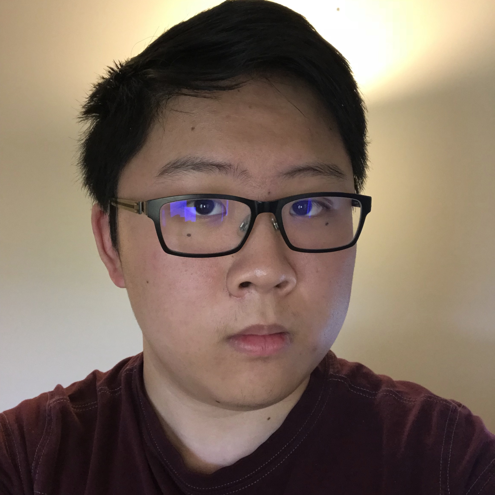

 

# Hi, my name is William 👋

I am a backend software engineer at Ramp. I enjoy tackling problems in (operating/distributed) systems and (programming/natural) languages, and I have a particular fondness for interesting visualizations and clever math.

Outside of technology, I keep up with competitive video games, make arrangements of my favorite songs, and dabble in recreational mathematics.

I’d love to chat – send me an email at [wm274@cornell.edu](mailto:wm274@cornell.edu).

---

### Experience

 * Senior Software Engineer @ Ramp
 * Software Engineer @ Juniper Networks
 * AR Research Intern @ Bosch Research
 * Systems / PL Research @ Cornell
 * NLP Research @ Cornell
 * iOS Developer / Pod Lead @ Cornell AppDev
 * Open-source Contributor @ Homebrew

### Education

 * M.Eng Computer Science @ Cornell '22
 * B.S. Computer Science @ Cornell '21, Summa Cum Laude
 * Minor in Mathematics @ Cornell '21
 * Arlington High School '18

__I'm an alum of the [Cornell University Glee Club](https://www.gleeclub.com).__
