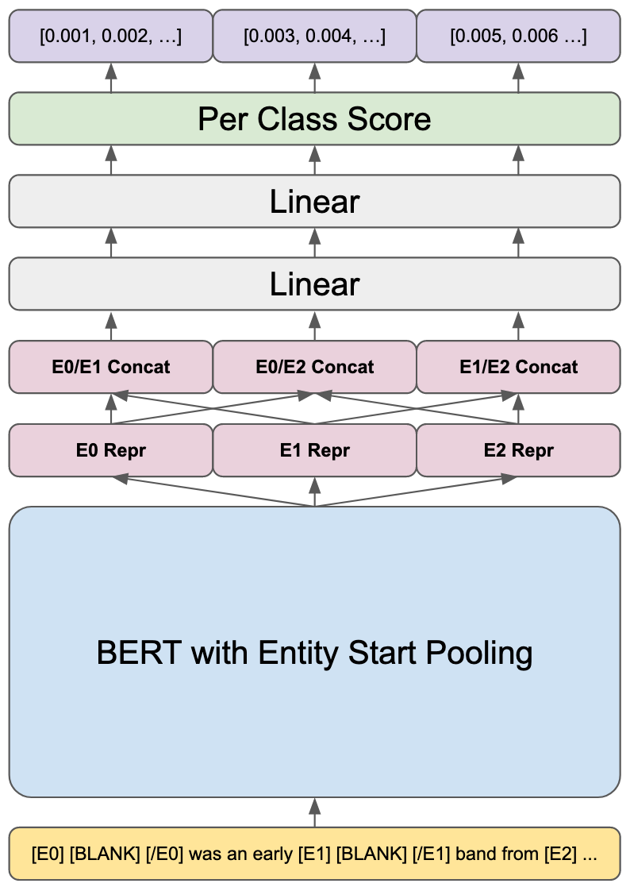

# Introduction

My name is William Ma.

---

## Projects

### [HarmonyLang](https://harmony.cs.cornell.edu) (2021 - 2022)

Harmony is a [model-checked](https://en.wikipedia.org/wiki/Model_checking) programming language for teaching concurrency and distributed systems. I prototyped and researched Harmony automata, and proposed an efficient algorithm for checking whether an implementation matches such an automata which is currently implemented and used by Harmony. I also implemented a source-to-source transpiler from Harmony to Python.

Here is a figure from my work showing the state graph for Peterson's algorithm. It illustrates the initial state (labeled `initial` in an octagon), the values of the `turn` and `flag` variables, the final state (labeled `__term__` in a double octagon), and all transitions between states.

### [Ocean Scene](https://github.com/whoiswillma/cs5625-final-project.git) (Spring 2022, [CS 5625](https://www.cs.cornell.edu/courses/cs5625/2022sp/))

### [Eatery Blue](https://github.com/cuappdev/eatery-blue-ios) (Winter 2022)

### [TriBlank](https://github.com/kabirwalia8300/TriBlank-paper/blob/main/TRIBLANK.pdf) (2021)

An investigation of an experimental training method for training transformer-based language models for relation extraction. Based on work done by [Sores et al. 2019](https://aclanthology.org/P19-1279.pdf). I proposed and implemented the models described in the paper, and helped contribute to the paper and experiments.

### [Sharm](https://github.com/whoiswillma/swift-harmony/blob/master/SharmPaper.pdf) (2021)

A unifying toolbox for Harmony, written in Swift. I completed this project myself, including developing the interpreter, doing performance optimizations and benchmarks, and writing the paper.

### [Homebrew](https://brew.sh/) (Summer 2020)

A package manager for macOS. I added license information to 2,500 packages and merged `brew` and `brew cask` commands.

### [Eatery](https://www.cornellappdev.com/eatery) (2018 - 2022)

An app to view Cornell dining hall hours and menus. I architected the iOS app and refactored the UI to be entirely programmatic. From 2018 to 2020, I helped grow the user base by about 20% to 7500 monthly-active users.

### Xi Compiler (Spring 2020, [CS 4120](https://www.cs.cornell.edu/courses/cs4120/2020sp/) Project)

A compiler for an imperative programming language. I implemented lexing with JFlex, parsing with CUP, type-checking, mid-level IR generation, low-level IR generation and optimization, and assembly code generation with register allocation.

---

## Education

 * Masters of Engineering, Computer Science at Cornell
 * Bachelors of Science, Summa Cum Laude, Computer Science at Cornell

---

I'm an alumnus of the [Cornell University Glee Club](https://www.gleeclub.com).
