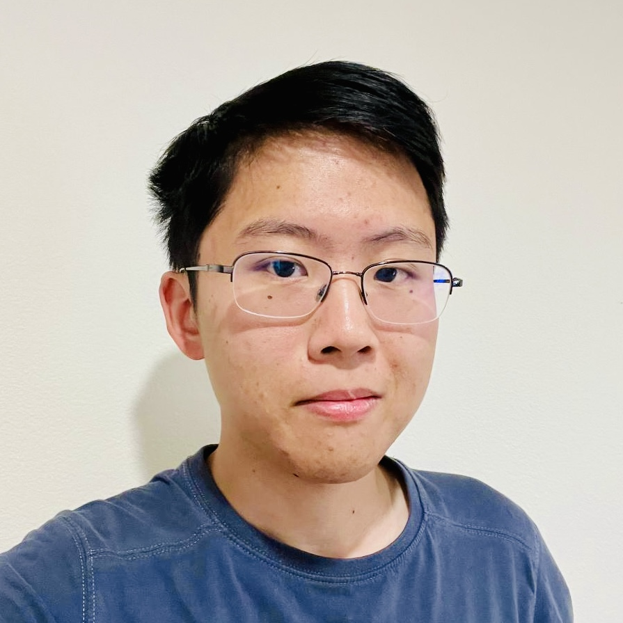

 

# Hi, my name is William 👋

I'm an Augmented Reality Research Intern at Bosch. I enjoy solving problems in systems and natural language, and I have a fondness for interesting visualizations and clever math as well.

Outside of technology, I keep up with competitive video games, make arrangements of my favorite songs, and dabble in recreational mathematics.

I’d love to chat – feel free to send me an email at [wm274@cornell.edu](mailto:wm274@cornell.edu).

_I am actively looking for software engineering positions to start in January 2023!_

---

### Experience

 * AR / NLP Research Intern @ Bosch Research
 * Systems / PL Research @ Cornell
 * NLP Research @ Cornell
 * iOS Developer / Pod Lead @ Cornell AppDev
 * Open-source Contributor @ Homebrew

### Education

 * M.Eng Computer Science @ Cornell '22
 * B.S. Computer Science @ Cornell '21, Summa Cum Laude

I'm an alum of the [Cornell University Glee Club](https://www.gleeclub.com).
