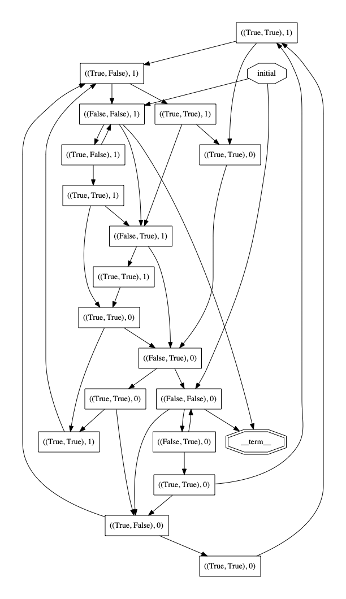
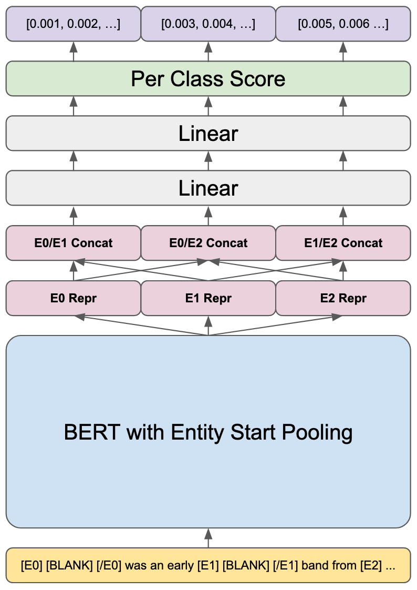

# Projects

## [HarmonyLang](https://harmony.cs.cornell.edu) (2021 - 2022)

Harmony is a [model-checked](https://en.wikipedia.org/wiki/Model_checking) programming language for teaching concurrency and distributed systems. It was most recently used at Cornell during the Spring '22 semester for teaching [CS 4410, Operating Systems](https://www.cs.cornell.edu/courses/cs4410/2022sp/).

_I prototyped and researched Harmony automata, and proposed an efficient algorithm for checking whether an implementation matches such an automata. This algorithm is currently implemented in and used by Harmony._ I also implemented a source-to-source transpiler from Harmony to Python.

    
Click for an explanation of the above figure.

     
    
Above is a figure from my work showing the state graph for Peterson's algorithm. It illustrates the initial state (labeled initial in an octagon), the values of the turn and flag variables, the final state (labeled __term__ in a double octagon), and transitions between states. 

    
From this state graph, it is possible to check whether an implementation matches this specification by checking whether the language of the implementation's state automaton is a subset of the specification's state automaton

 

## [Ocean Scene](https://github.com/whoiswillma/cs5625-final-project.git) (Spring 2022, [CS 5625](https://www.cs.cornell.edu/courses/cs5625/2022sp/))

A real-time rendered scene of a boat bouncing in the ocean with seagulls flying above. The whole project is a based around a multi-staged deferred rendering pipeline which I contributed. I also implemented the [Tessendorf](https://people.cs.clemson.edu/~jtessen/reports/papers_files/coursenotes2004.pdf) ocean wave simulation.

## [Eatery Blue](https://github.com/cuappdev/eatery-blue-ios) (Winter 2022)

## [TriBlank](https://github.com/kabirwalia8300/TriBlank-paper/blob/main/TRIBLANK.pdf) (2021)

An investigation of an experimental training method for training transformer-based language models for relation extraction. Based on work done by [Sores et al. 2019](https://aclanthology.org/P19-1279.pdf). I proposed and implemented the models described in the paper, and helped contribute to the paper and experiments.

## [Sharm](https://github.com/whoiswillma/swift-harmony/blob/master/SharmPaper.pdf) (2021)

A unifying toolbox for Harmony, written in Swift. I completed this project myself, including developing the interpreter, doing performance optimizations and benchmarks, and writing the paper.

## [Homebrew](https://brew.sh/) (Summer 2020)

A package manager for macOS. I added license information to 2,500 formulae (packages) and merged `brew` and `brew cask` commands.

Contributions:
  - [brew](https://github.com/Homebrew/brew/pulls?q=author%3Awhoiswillma+): merging of `brew` and `brew cask` commands, as well as various other bug fixes and features.
  - [homebrew-core](https://github.com/Homebrew/homebrew-core/commits?author=whoiswillma): added license information to over 2,500 formulae, which was about a half of all formulae at the time.

## [Eatery](https://www.cornellappdev.com/eatery) (2018 - 2020)

An app to view Cornell dining hall hours and menus. I architected the iOS app and refactored the UI to be entirely programmatic. During my tenure, I helped grow the user base by about 20% to 7500 monthly-active users.

## Xi Compiler (Spring 2020, [CS 4120](https://www.cs.cornell.edu/courses/cs4120/2020sp/) Project)

A compiler for an imperative programming language. I implemented lexing with JFlex, parsing with CUP, type-checking, mid-level IR generation, low-level IR generation and optimization, and assembly code generation with register allocation.
